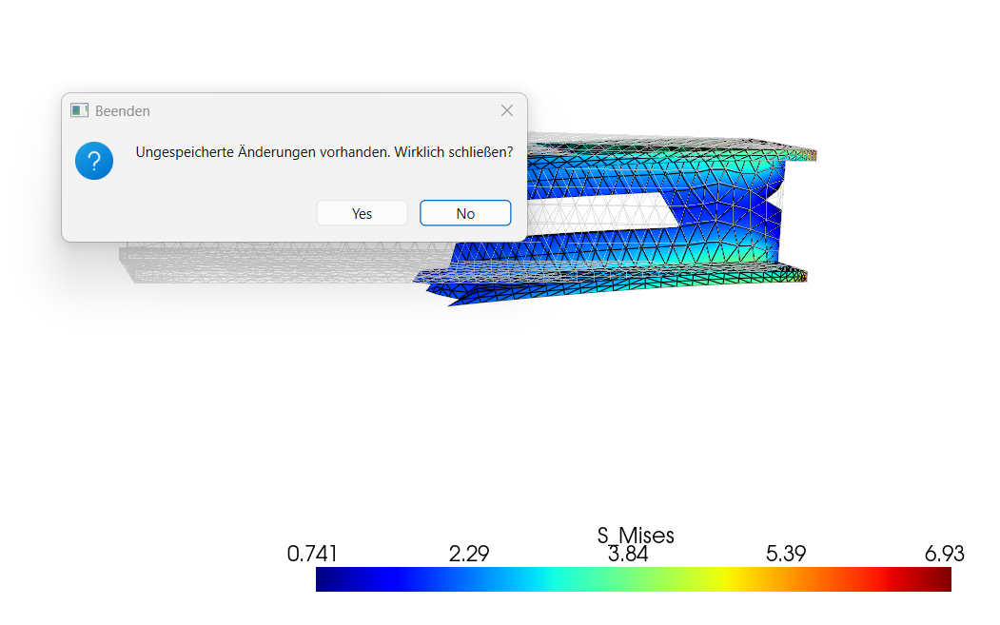
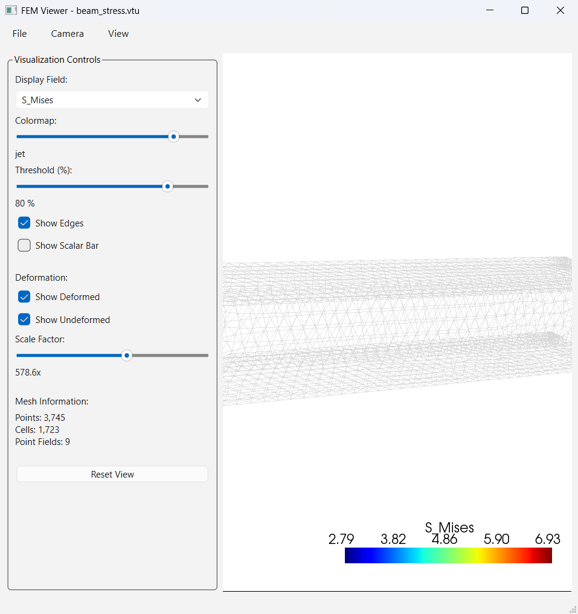
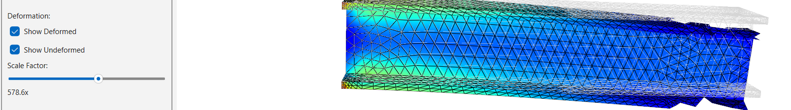
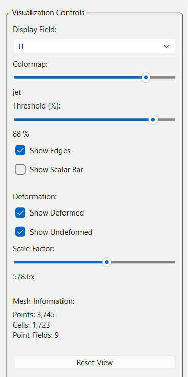

# Interactive FEM Results Viewer
**Gregor Lindmair**
Visualization & Data Processing - Final Project 2025/26

---

## Problem / Motivation
- **Engineering-Herausforderung:** FEM-Berechnungen (Finite-Elemente-Methode) erzeugen komplexe 3D-Daten, die oft nur in teurer Spezialsoftware eingesehen werden können.
- **Ziel:** Ein einfaches, intuitives Tool zum Anzeigen von Simulationsergebnissen.
- **Nutzen:** Schnelle visuelle Beurteilung von Spannungen und Verformungen, sowie Anzeige direkt auf dem Mesh, ohne teure Software.

---

## Approach
- **Frontend:** Nutzung von **PyQt6** für ein modernes, responsives User Interface.
- **3D Engine:** Integration von **PyVista** (VTK-Backend) für FEM - Aufgaben.
- **Workflow:** 
1. Laden von VTK/VTU-Dateien.
2. Interaktive Manipulation der Ansicht und der geforderten Größen
(Verschiebungen, v'Mises Spannungen).
3. Visuelle Überlagerung von verformten und unverformten Zuständen.
4. Implementieren von Shortcuts für die Ansicht und "Schritt zurück"
5. Speichern einer Ansicht und Rückkehr nach Manipulation der Grafik

---

  

---

## Implementation Highlights
- **Deformations-Berechnung:** Dynamische Berechnung der Knotenverschiebung durch Vektoraddition ($U_{def} = U_{orig} + Skalierungsfaktor \cdot U$).
- **Kamera System:** Implementierung einer Historie (Undo/Redo) für Kamerapositionen und vordefinierte Ansichtsachsen (Top, Front, ISO).
- **Daten-Filterung:** Echtzeit-Thresholding basierend auf Skalarwerten zur Identifikation kritischer Bauteilbereiche.

---

  

---

## Demo
- **Live-Interaktion:**
  - Umschalten zwischen Spannungsfeldern (Point Data).
  - Stufenlose Skalierung der Verformung via Slider.
  - Wechsel der Colormaps (Viridis, Plasma, etc.) für besseren Konstrast.
  - Manipulieren der Anzeige mit Shortcuts 
  - Speichern einer Ansicht und Rückkehr nach Manipulation der Grafik

  

---

## Results
- **Performance:** Flüssiges Rendering auch bei komplexen Meshes durch effiziente PyVista-Integration.
- **Usability:** Intuitive Steuerung der Visualisierungsparameter über das Seitenpanel.
- **Feature Complete:** Erfolgreiche Implementierung von Screenshot-Export und Mesh-Informationsanzeige.

---

## Challenges & Solutions
- **
- **Kamera-Management:** Speichern von max. 20 Manipulationen und Rückkehr auf eine extra gespeicherte Ansicht. 
Implementierung von Shortcuts "front", "top" und "isometric".
- **Integration:** Synchronisation zwischen PyQt-Slidern und der VTK-Render-Pipeline.
---

  

---

## Lessons Learned
- **Implemetierung:** Implementierung unterschiedlicher Aufgabenstellungen in unterschiedlichen Gebieten (Visualisierung, Manipulation durch Regler, Buttons, Slides etc.)

- **GUI Design:** Gestaltung einer Benutzeroberfläche, die komplexe wissenschaftliche Daten zugänglich macht.

---

## 
**Vielen Dank für Ihre Aufmerksamkeit!**

Fragen?

---